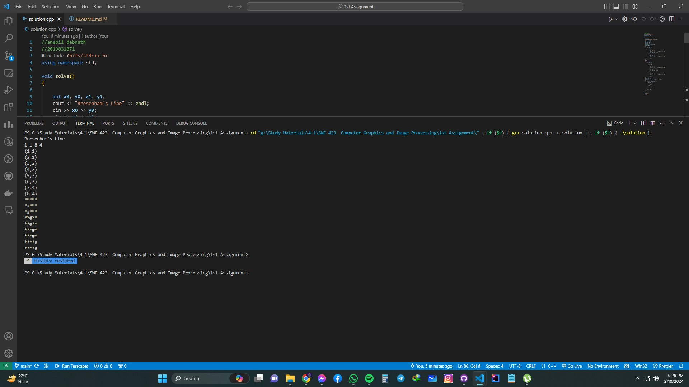
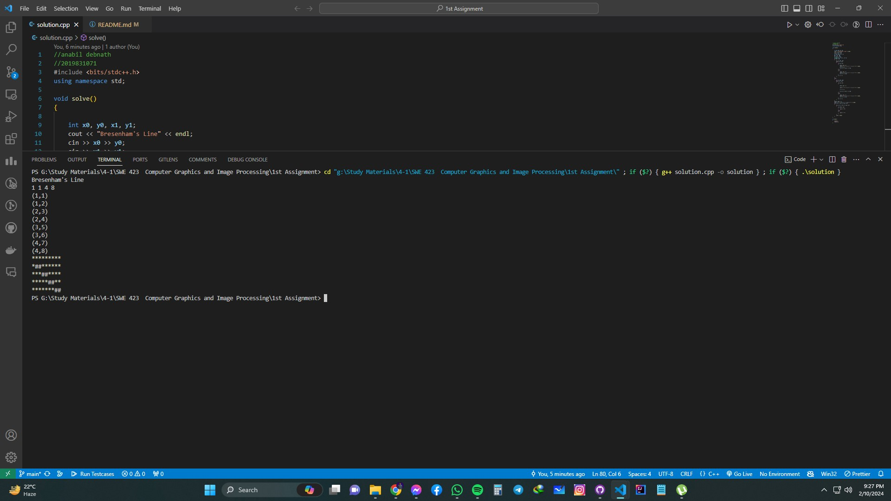

# Bresenham's Line Drawing Algorithm

  This is an implementaion of Bresenham's Line Drawing Algorithm for the slope of 0 < m < 1 and m>1.

### Adjustments for Slopes Greater Than 1 in Bresenham's Line Drawing Algorithm

* **Iteration Along Y-Axis:**
  * Instead of iterating along the x-axis, the algorithm advances along the y-axis.
  * Each step maintains a constant change in the y-coordinate, simplifying calculations.
* **Interchange of Roles of X and Y:**
  * The roles of x and y are swapped, altering the heading of traversal.
  * Pixel selection and parameter calculations prioritize changes in the y-coordinate.
* **Adjustment of Decision Parameter:**
  * The decision parameter (D) is recalculated based on changes in the y-coordinate.
  * Ensures precise determination of pixel selection along the line's trajectory.

Test Case 1:

Test Case 2:

